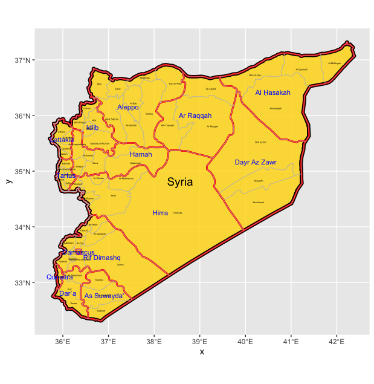
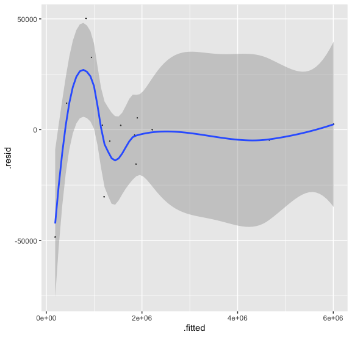
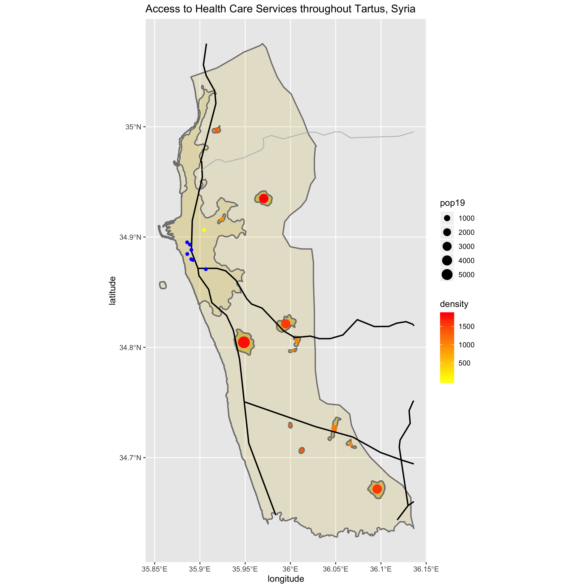
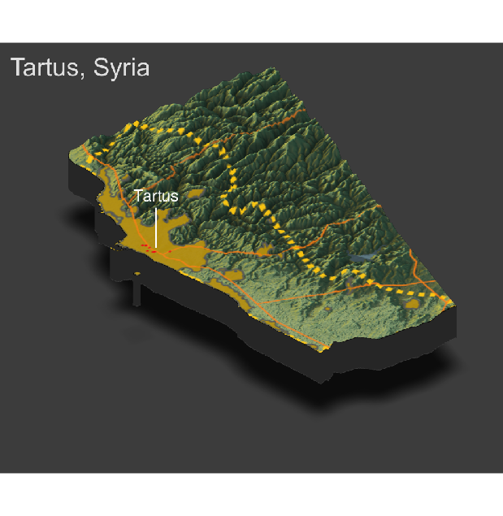

# Wicked Problems Final Project: Syria

## Political  Subdivisions 

Syria is broken up into 2 administrative subdivisions: adm1 and adm2. Syria has a population of around 17 million and is situated in the Middle East near the Mediterranean coast. There are 14 governates (adm1) regions and 65 districts (adm2). The image above shows Syria broken down into its governates and districts. The text in blue are the names of the governates, which are outlined in red. The districts are outlined in gray and the names of each appear in black.

## Population

The population density of each governate is shown above. These bar and spatial plots show that Aleppo, the old capital of Syria, and Rif Dimashq-the area outside of Damascus, the current capital-are very heavily populated. Aleppo was the end of the Silk Road, and is close to the Mediteranean Sea, which is why it is still so heavily populated. Tartus, my area of focus, is the third least dense region in Syria which most likely is due to it being one of the smallest governates in Syria.

This regresion model describes the relationship between the population of Syria and 12 land cover and land use covariates used as population predictors. For this model, all of the variables were used. The R-squared value for this  model is 0.998, which is very close to 1, and the p value is statistically significant. This indicates a strong relationship between population and all of the variables. The model using just night time lights, urban cover, and bare cover variables did not prove to be statistically significant, which indicates that it is best to use the sum of all the covariates in order to get the best population prediction.

## Human settlements, roadways, and health care facilities

While I focused on Syria as a whole in the begining of my analysis, I looked at Tartus, a district in the Tartus governate, for a more in-depth analysis later on in the semester. Tartus has a population of around 280,000 and contains a major port city, also named Tartus. Tartus city is also home to a Russian Naval Base.

This plot shows primary and secondary road networks throughout Tartus, as well as health care facilities in the region and  urbanized areas along with their respective densities and populations. Health care facilities were categorized as hospitals and clinics. Hospitals appear on the plot as blue circles and there were no clinics in this region. There are 7 hospitals located in Tartus, all of which are clustered by the coast of the Mediterranean near Tartus City. As mentioned above, it is a major port city and it is located very close to Cyrpus which most likely plays into why all the health care services are located in that specific area. There are also three-four primary roads (dark black, bolded lines) in the Tartus governate, and one secondary road (light gray line). For the most part, the major roadways pass through or go nearby most of the densily populated ubranized areas. There is also a primary road that goes along the coast which makes all of the hospitals very easily accessible. One thing to note, however, is that the roadways dataset was obtained from DIVA.gis and is not the most up to date, so it is highly likely that there are more roads now than there were when this data was collected.

