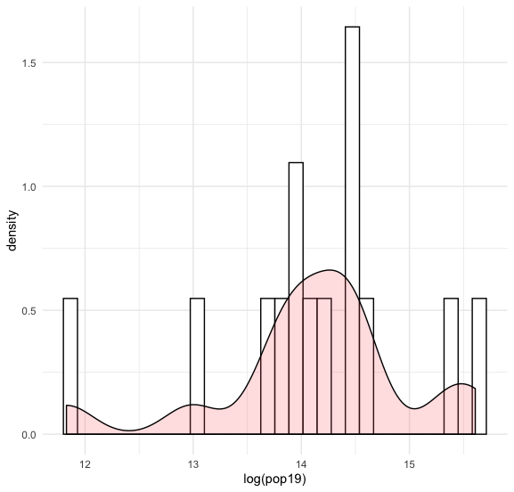
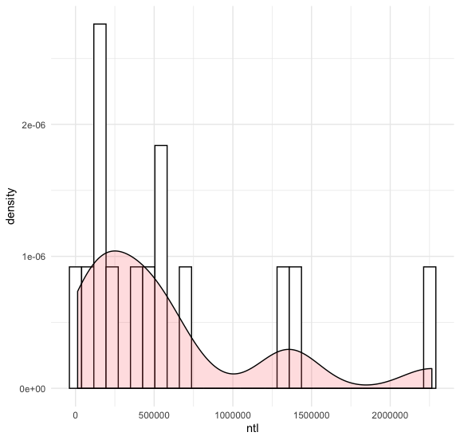
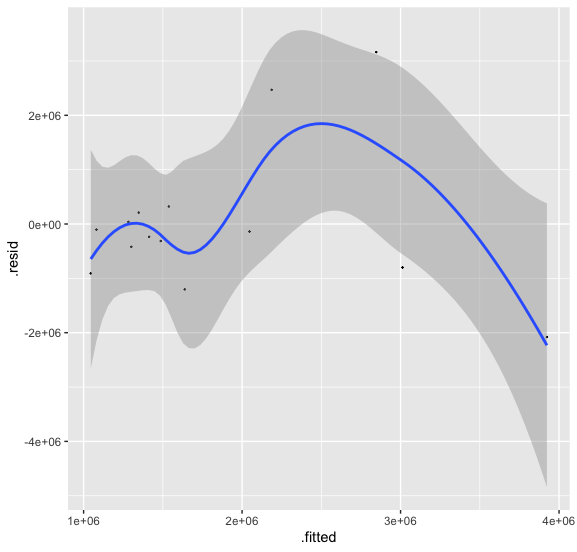
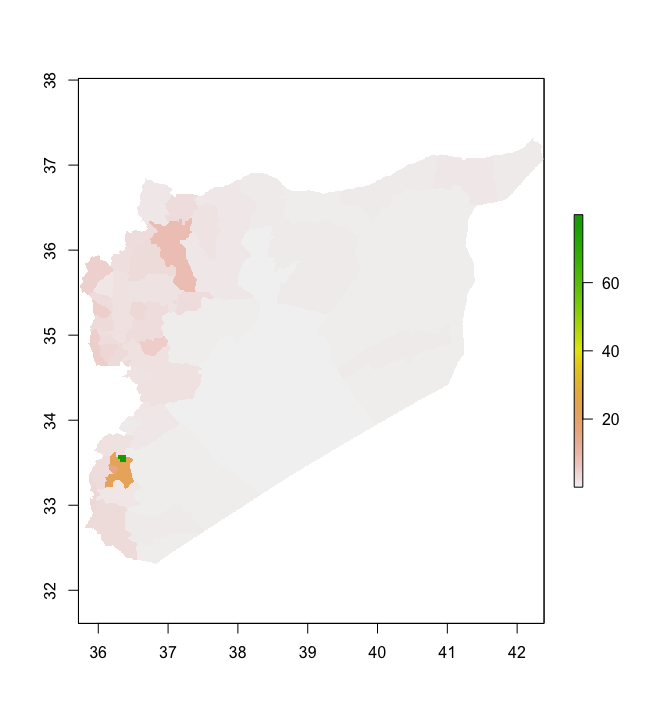
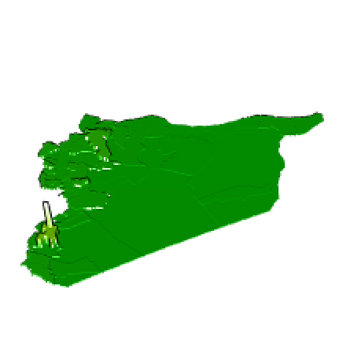
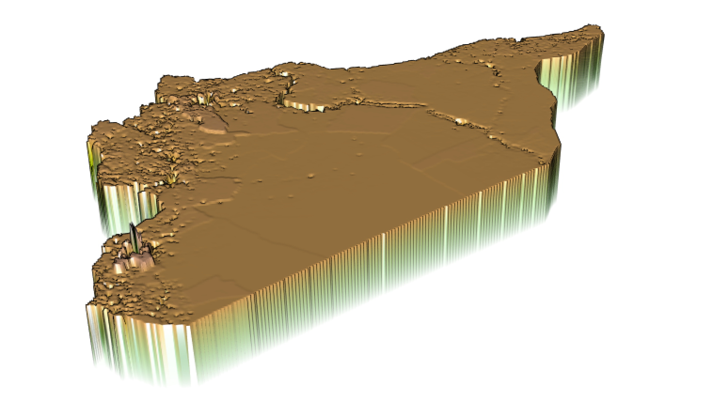
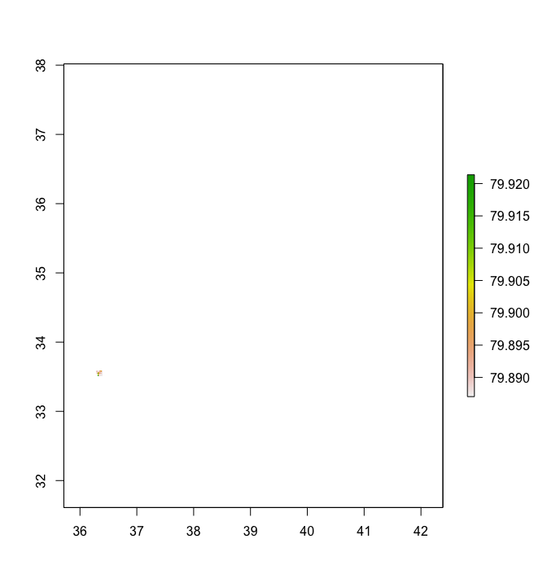
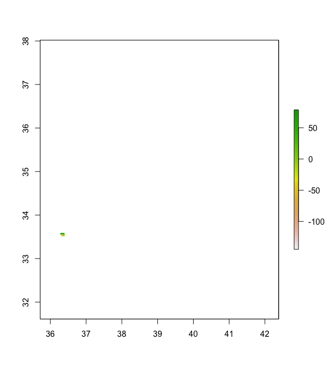

# Project 2: Syria

## Part 1: Acquiring, Modifying and Describing the Data
### Population Log ًًًwith Density

### Night Time Lights with Density

### Residual Model with Night Time Lights, Urban Cover, and Bare Cover Variables

R-sqaured: 0.2821

p-value: 0.3248

### Residual Model with All Variables 

R-sqaured: 0.9998

p-value: 0.0402

The R-squared value for the last model is 0.998, which is very close to 1, and the p value is statistically significant. This indicates a strong relationship between population and all of the variables. The model using just night time lights, urban cover, and bare cover variables did not prove to be statistically significant, which suggests that it's best to use the sum of all the covariates in order to get the best population prediction.

# Part 2: Modeling and Predicting Spatial Values
## Population and Differences Maps of Syria

This map shows the population of Syria as predicted by our model in part 1 of this project.

The image above shows the differences between the predicted populations and population based on the Wold Pop dataset. The population is accurate for much of Syria, however it is  underpredicted in the two most populous regions--Aleppo and Damascus. 

Here is the 3D Plot for the entirety of Syria, and again you can see that the population is very unpredicted for Damascus and the surrouding area. From the 3D plot, it does not look like the erorr is large for the region of Aleppo like it inidicated from the mapview image above.

## Damascus Subdivision of Syria

This plot shows the population for Damascus, Syria

The image above is the

Here  the mapview for Damascus. As you can see, it doesn't line up nicely with the boundaries of Damascus which is what I am trying to fix.

There were a few troubles I encountered with this project. The first was having to run the code--especially the clusters--on my home wifi as it is really slow considering there are many of us using the network at the same time. Another trouble was that I was unable to download the 2015 population raster, which is most liklely why Damascus was very underpredicted. The night time lights, land cover, etc. covaraites that I used were from 2015 but the population file that I used to create my model was from 2019. The population of Damascus had grown during those 4 years, which most likely accounts for this big difference. Additionally, even though I cropped and masked Damascus, I was unable to make the 
