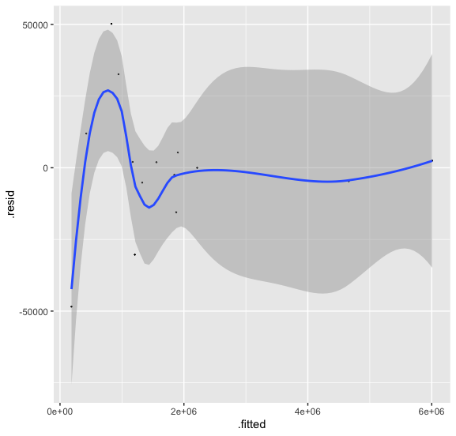

# Project 2: Syria

## Part 1: Acquiring, Modifying and Describing the Data
### Population Log ًًًwith Density

### Night Time Lights with Density

### Residual Model with Night Time Lights, Urban Cover, and Bare Cover Variables

R-sqaured: 0.2821

p-value: 0.3248

### Residual Model with All Variables 

R-sqaured: 0.9998

p-value: 0.0402

# Part 2: Modeling and Predicting Spatial Values
## Population and Differences Maps of Syria

This image shows the differences in population for the world pop data and our predicted values.

This map shows the direction and magnitude of error for the predicted values.

Here is the 3D Plot for the entirety of Syria, and shows the error between the two population values.

As can be seen from all of these plots, Damascus and the area outisde of Damascus, Raf al-Damascus, are very heavily populated. 

## Damascus Subdivision of Syria
### I subsetted the adm2 region of Damascus and mapped both the population differences for the predicted and world pop data and the error. 

This is the difference map for Damascus

This is the map showing the error for the predicted values

Here is the mapview for Damascus. As you can see, it doesn't line up nicely with the boundaries of Damascus which is what I am trying to fix.

