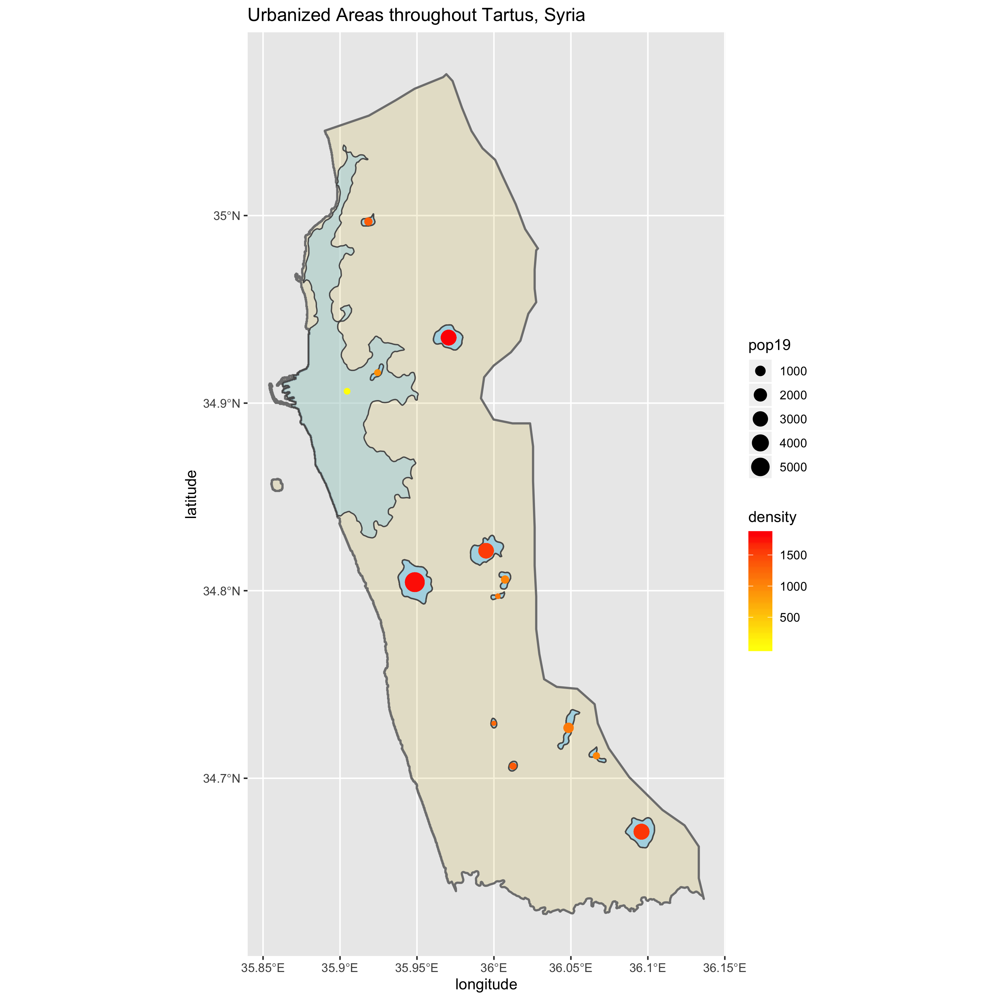

# Project 3: Accessibility to health care through transportation facilities

## Part 1: De facto description of human settlements and urban areas
### Tartus, Syria Urbanized Areas

For part 3, I decided to look at Tartus, an adm2 goverorate, that is situated along the Mediterranean coast in Syria. It is the second largest port cit, and has a population of about 115,000 people. This first plot shows the urbanized areas in Tartus, along with the densities and population of each area. There are a total of 12 urbanized areas in Tartus. Interestingly, the urbanized area closesd to the sea is the largest one but has the smalled density and population compared to  the other 11 urban areas. Besides this one urbanized area, the next four largest areas are very densily populated with densities between 1200-2000 and populations between 4000-5000.

## Part 2: Adding transportation facilities and health care services
### Major road networks and health care facilities throughout Tartus, Syria

This plot shows primary and secondary road networks throughout Tartus, as well has health care facilities in the region. As seen in the first plot, the urbanized areas along with their respective densities and populations are shown here. Health care facilities were categorized as hospitals and clinics. Hospitals appear on the plot as blue circles and there were no clinics in this region. There are 7 hospitals located in Tartus, all of which are clustered by the coast of the Mediterranean. As mentioned above, Tartus is a major port city and it is located very close to Cyrpus which most likely plays into why all the health care services are located in that specific area. There are also three-four primary roads (dark black, bolded lines) in Tartus, and one secondary road (light gray line). For the most part, the major roadways pass through or go nearby most of the densily populated ubranized areas. There is also a primary road that goes along the coast which makes all of the hospitals very easily accessible. One thing to note, however, is that the roadways dataset was obtained from DIVA.gis and is not the most up to date, so it is highly likely that there are more roads now than there were when this data was collected.

