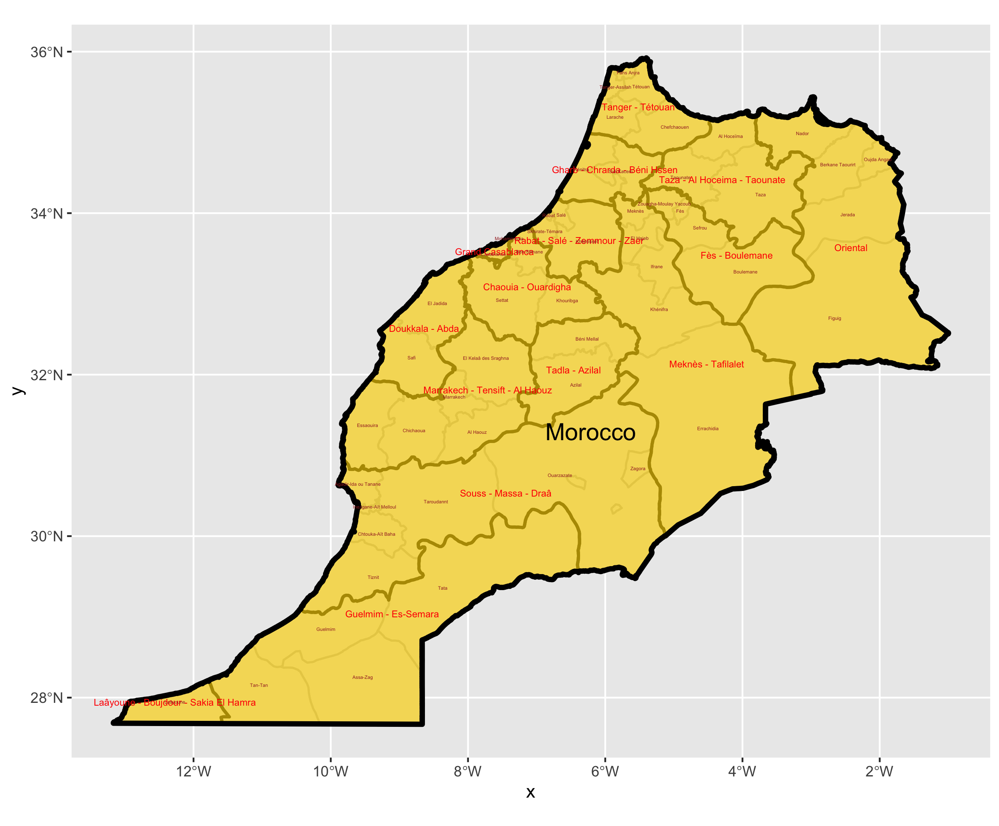
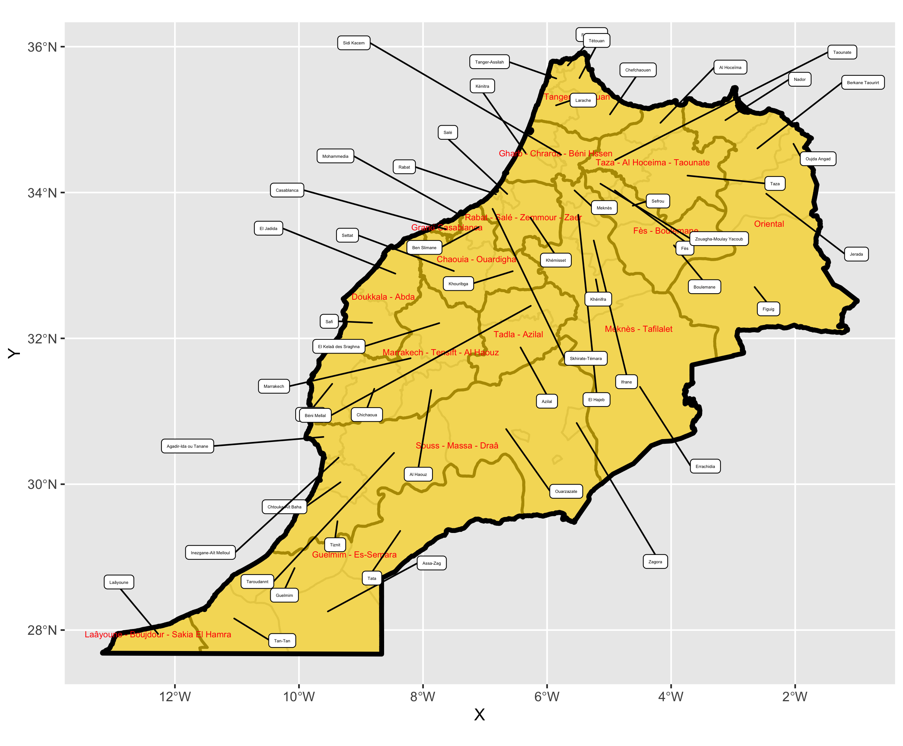
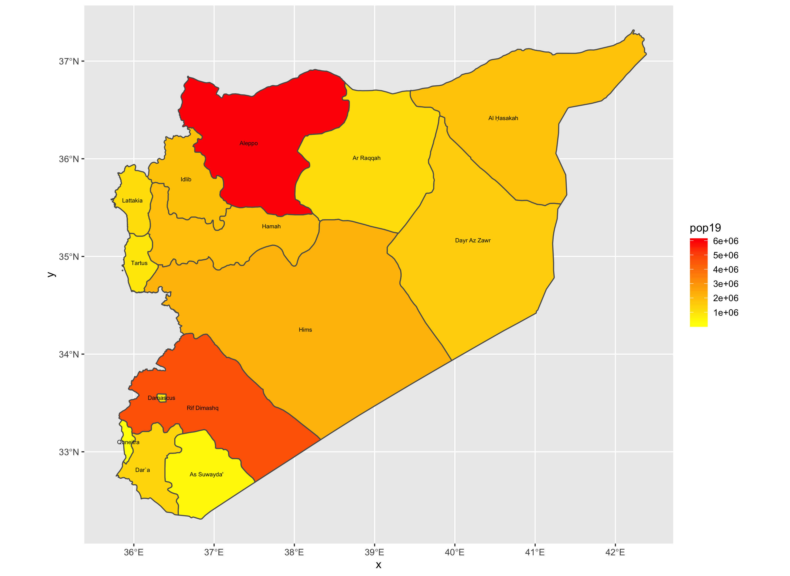
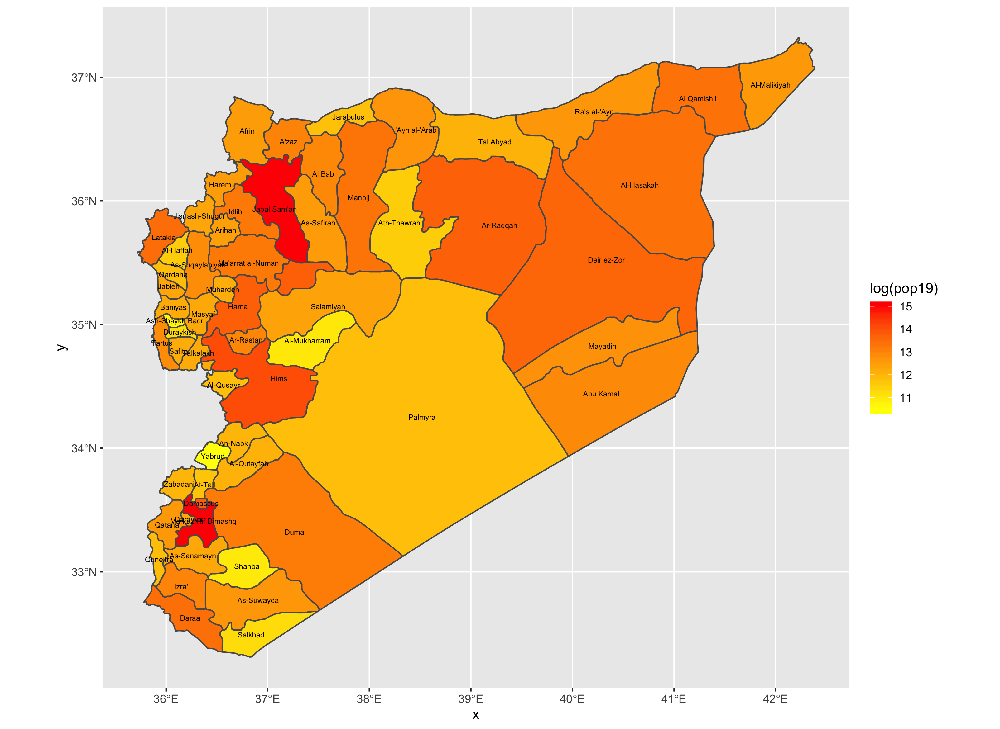
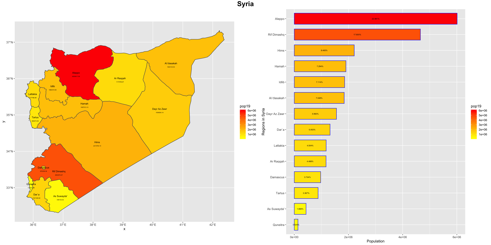

# Project 1

Zyannah Mallick

## Part 1
### Administrative Subdivisions of Morocco

The first image shows Morocco broken down into its regions (1st administrative level) and provinces (administrative level 2). My biggest challenge with this section was that because some of the regions in Morocco had names that were four words long, the first administative level labels covered up the second administrative labels. I tried to fix this by using label repel but this made it look really messy in my opinion (see second image) so I decided to change the text color instead so even if the text overlapped, it would still be somewhat readable.

## Part 2
### Populations in Syria in the First Administrative Subdivisions

### Stretch Goal 1
#### Populations in Syria in the Second Administrative Subdivisions

Part two is where I switched over to Syria, as Morocco had to many grid cells and I did not want to focus on just one reigon of Morocco. The first image shows the populations in Syria's governoates/provinces (adm1) and the second image is its districts (adm2). The stretch goal was fairly straightforward, as I only had to switch adm1 with adm2. For this part, I sometimes had trouble identifying when to use what variable and where as I would sometimes get confused with the totals varaible versus population values variable but with help from my teammates, I was able to figure it out. 

## Part 3
### Population Density of Syria in 2019

My biggest challenge here was that I forgot to include fill=pop19 in the code when making the plots and I couldn't figure out why my plots weren't accurate but with a little bit of help from Profesor Frazier, I was able to figure out what was wrong and fix it.

These bar and spatial plots show that Aleppo, the old capital of Syria, and Damascus, the current capital, are the most populous districts. Interestingly, Damascus itself doesn't show up as red on both the bar and spatial plots but I think this is because while it does have the largest persons/km^2 of all the provinces, it has a very small area compared to the rest of the provinces. As you can see from the plots, Rif Dimashq-the area outside of Damascus-is also very heavily populated, which is most likely due to its proximity to Damascus. The provinces on the west side of Syria are more populous because they are along the Mediterranean Sea. Aleppo was the end of the Silk Road, which is why it is still so heavily populated.

